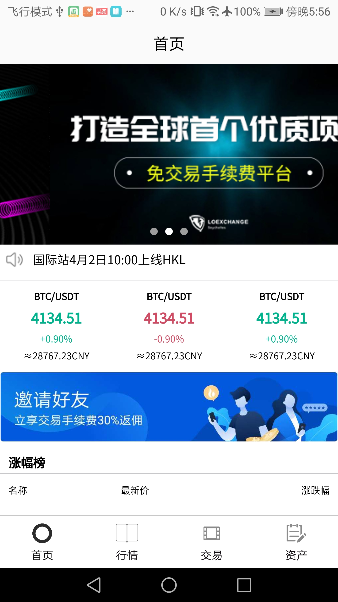
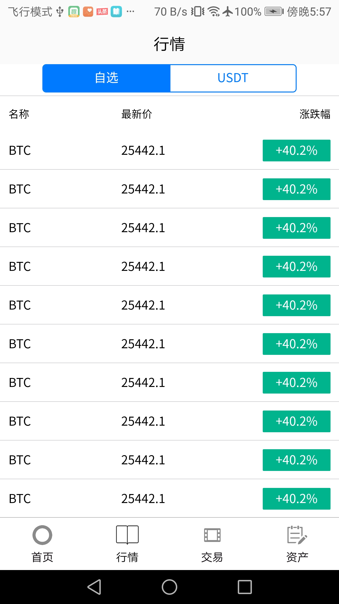
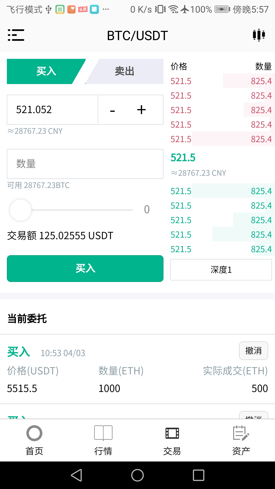
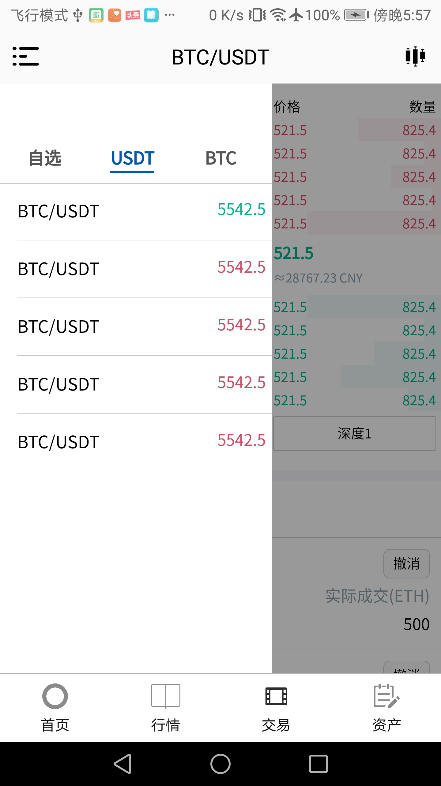
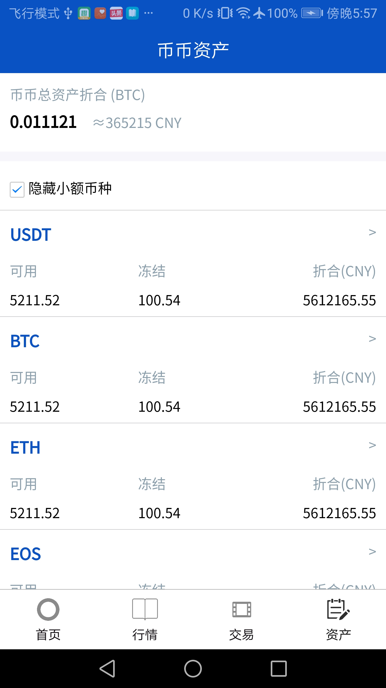

### [开源数字货币钱包](https://gitee.com/koch/fex-wallet-app)

#### 技术交流社区

##### 微信二维码:&nbsp;&nbsp;&nbsp;&nbsp;&nbsp;&nbsp;&nbsp;&nbsp;&nbsp;&nbsp;&nbsp;&nbsp;&nbsp;&nbsp;&nbsp;&nbsp;&nbsp;&nbsp;&nbsp;&nbsp;&nbsp;QQ二维码:
 
 

#### 介绍
数字货币交易所移动端UI

 
#### 
 
#### 
 
#### 
 
#### 
 
#### 
 

#### 安装教程

1. 下载HbuilderX
2. 手机USB连接电脑
3. 打开开发者模式, USB调试
4. 打开HbuilderX, 选择 运行 -> 运行到手机或模拟器 -> 选择连接的手机  等待安装

#### 使用说明

1. 将项目拖入[HbuilderX](http://www.dcloud.io/hbuilderx.html) 
2. 运行命令 

   npm install pako

   npm install uview-ui

   npm install @dcloudio/uni-ui

   npm install vue-moment
3. [uni-app教程](https://uniapp.dcloud.io) 
